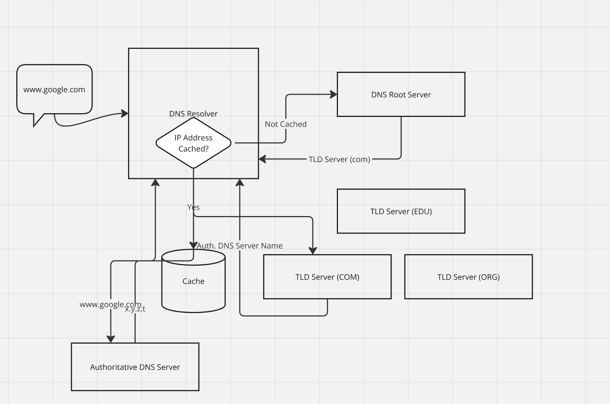

### 1. **User Request**
When you type a domain name (e.g., www.example.com) into your web browser, the browser needs to find the IP address of the server that hosts the website.

### 2. **DNS Resolver**
Your device contacts a DNS resolver, often provided by your Internet Service Provider (ISP). The resolver’s job is to find the IP address associated with the domain name.

### 3. **Root Server**
If the resolver doesn’t have the IP address cached, it queries a root DNS server. Root servers are the top level in the DNS hierarchy and direct the resolver to the appropriate top-level domain (TLD) server (.com, .org, .net, etc.).

### 4. **TLD Server**
The resolver then queries the TLD server, which provides the address of the authoritative DNS server for the specific domain (example.com).

### 5. **Authoritative DNS Server**
The resolver contacts the authoritative DNS server for the domain, which contains the actual DNS records, including the IP address of the requested domain.

### 6. **Response to Resolver**
The authoritative server returns the IP address to the resolver.

### 7. **Caching**
The resolver caches this IP address for a specified time (Time to Live or TTL) to speed up future requests for the same domain.

### 8. **Response to User**
The resolver sends the IP address back to your device.

### 9. **Connection to Server**
Your browser uses the IP address to establish a connection to the web server and request the webpage.

### Key Components of DNS:
- **DNS Resolvers**: Act as intermediaries between the user and DNS servers.
- **Root Servers**: Direct queries to appropriate TLD servers.
- **TLD Servers**: Handle domains within specific TLDs (like .com, .org).
- **Authoritative DNS Servers**: Store DNS records for specific domains.
- **Caching**: Helps reduce load times and server requests by temporarily storing IP addresses.

### Types of DNS Records:
- **A Record**: Maps a domain to an IPv4 address.
- **AAAA Record**: Maps a domain to an IPv6 address.
- **CNAME Record**: Alias for one domain to another.
- **MX Record**: Mail exchange servers for email.
- **TXT Record**: Text information for various purposes (e.g., SPF records for email).

### Conclusion
DNS operates behind the scenes to make internet browsing user-friendly, allowing us to use easy-to-remember domain names instead of numerical IP addresses. Its hierarchical structure and caching mechanisms ensure efficient and fast resolution of domain names.

Limitations of DNS

Despite its critical role in internet infrastructure, the Domain Name System (DNS) has several limitations and vulnerabilities. Here are some of the main limitations:

### 1. **Security Vulnerabilities**
- **DNS Spoofing (Cache Poisoning)**: Attackers can corrupt the cache of a DNS resolver by inserting false address records, leading users to malicious sites.
- **DDoS Attacks**: Distributed Denial of Service (DDoS) attacks can overwhelm DNS servers, rendering them unable to respond to legitimate queries.
- **DNS Hijacking**: Attackers can redirect queries to malicious DNS servers, leading users to fraudulent websites.

### 2. **Lack of Privacy**
- **Unencrypted Queries**: Traditional DNS queries and responses are sent in plaintext, allowing eavesdroppers to monitor and log user activities.
- **DNS Leakage**: DNS requests can sometimes bypass VPNs, exposing user browsing habits to ISPs or other third parties.

### 3. **Scalability and Performance Issues**
- **Latency**: DNS resolution can introduce latency, especially if multiple queries are required to resolve a single domain name.
- **Load on Root and TLD Servers**: Increased internet usage can put a strain on root and TLD servers, potentially causing slowdowns or outages.

### 4. **Configuration Complexity**
- **Misconfigurations**: Incorrect DNS settings can lead to downtime, security vulnerabilities, and misdirection of traffic.
- **Propagation Delays**: Changes to DNS records can take time to propagate throughout the internet, leading to inconsistencies.

### 5. **Dependence on Centralized Systems**
- **Single Points of Failure**: The hierarchical nature of DNS means that issues with higher-level servers (like root or TLD servers) can impact large portions of the internet.
- **Centralization Concerns**: A few entities control critical parts of the DNS infrastructure, which can be a concern for resilience and neutrality.

### 6. **Limited Support for Modern Requirements**
- **Dynamic Updates**: DNS was not designed for frequent updates, which can be problematic for dynamic environments like cloud computing.
- **Support for New Protocols**: Integrating newer protocols like DNS over HTTPS (DoH) and DNS over TLS (DoT) requires updates to infrastructure and software.

### 7. **Naming Conflicts**
- **Domain Squatting**: Individuals or entities may register domain names with the intent to resell them at a higher price.
- **Conflicts with New TLDs**: The introduction of new top-level domains (TLDs) can lead to conflicts and confusion over domain names.

### 8. **Fragmentation**
- **Alternate DNS Roots**: The existence of alternative DNS roots can lead to fragmentation of the namespace, where different systems resolve the same domain names differently.

### Addressing DNS Limitations:
- **Security Enhancements**: Implementing DNSSEC (DNS Security Extensions) to ensure data integrity and authenticity.
- **Privacy Improvements**: Adopting DNS over HTTPS (DoH) and DNS over TLS (DoT) to encrypt DNS queries.
- **Redundancy and Load Balancing**: Using redundant DNS servers and load balancing to mitigate single points of failure and distribute query loads.
- **Education and Best Practices**: Encouraging best practices for DNS configuration and management to reduce the risk of misconfigurations and improve overall reliability.